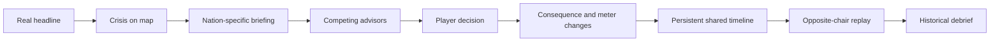
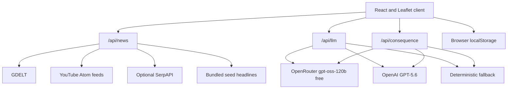

# STATE OF PLAY

> The headline is real. The next move is yours.

STATE OF PLAY is an AI-assisted geopolitical strategy game that turns real news into playable crisis simulations. Instead of asking a chatbot what happened, the player enters the situation room, hears competing advice, commits a national response, and lives with the consequences.

The current MVP follows one shared crisis through two seats of power: Washington and Caracas. A decision made as the United States changes the version of the same event later presented to Venezuela. The result is one timeline, two perspectives, and a concrete way to explore how policy choices create second-order effects.

This project was built for the OpenAI Build Week Challenge with Codex.

## Why this exists

We are living through a period in which wars, elections, sanctions, climate shocks, economic decisions, public-health emergencies, and technological shifts reach into ordinary life almost immediately. Yet the systems through which many people encounter these events are optimized for speed, reaction, and replacement. A major story appears between entertainment clips, receives a few seconds of attention, and is displaced by the next trend before its causes, human stakes, or consequences have been understood.

That is not a lack of information. It is a lack of meaningful contact with information. A headline may tell us that a leader imposed sanctions, opened a relief corridor, moved troops, or rejected a negotiation. It rarely lets us feel the constraints surrounding that choice, see what had to be sacrificed, or understand why the same action can look responsible from one capital and threatening from another. When events are reduced to fragments, people can become spectators to forces that shape their prices, safety, rights, communities, and future.

Education should create the time and structure that the attention economy removes. It should help learners pause, investigate evidence, encounter conflicting interests, make a reasoned choice, and examine what follows. News is usually consumed at a distance. Articles describe decisions after they have been made, quizzes test recall after reading, and general-purpose chatbots explain events in a conversational window. All three approaches can be useful, but none gives the learner a steering wheel.

AI gives us an opportunity to build a different relationship with knowledge. Its educational future should not be limited to chatbots that summarize chapters, answer questions, or generate quizzes. AI can become a simulation layer between information and understanding. It can transform a documented event into a structured space for practice, let a learner inhabit more than one perspective, respond to the learner's decisions, and then reconnect that experience to evidence and the historical record.

STATE OF PLAY begins with current affairs because their urgency is visible, but the model extends to the past. Learners could enter a diplomatic breakdown, a constitutional crisis, an economic turning point, or a public-health response and confront the decisions that shaped it. They would not rewrite history or receive an AI-generated version as truth. They would use counterfactual play to understand why events unfolded, what alternatives existed, who carried the costs, and why leadership is more difficult than hindsight makes it appear.

STATE OF PLAY adds a practical layer:

1. A real headline becomes a crisis.
2. The player receives a nation-specific intelligence briefing.
3. Two advisors expose competing strategic priorities.
4. The player chooses a response under uncertainty.
5. The world state changes and the decision becomes part of a persistent timeline.
6. The same event can be replayed from the rival nation's chair.
7. A debrief compares the player's path with the historical record.

The goal is not to predict the future or declare a correct political answer. The goal is to make causality, tradeoffs, perspective, and uncertainty tangible. If successful, this approach can help turn passive awareness into active civic and historical understanding. It can give teachers a new medium for discussion, give students a reason to investigate beyond the headline, and give people of different ages a safe place to appreciate the weight carried by real decisions.

## The 10-second experience

The opening establishes the stakes immediately: a real event is already unfolding, four national indicators are exposed, and the player must act. Every choice can strengthen one objective while damaging another. Survive a six-turn term, preserve the state, and discover how the other side experiences the consequences of your decisions.

## What the MVP does today

- Converts current US and Venezuela headlines into crisis markers on an interactive Leaflet map.
- Pulls keyless live articles from GDELT and keyless public YouTube channel feeds.
- Optionally augments news discovery through SerpAPI.
- Always falls back to bundled seed headlines when live sources are unavailable.
- Generates nation-specific briefings, threat assessments, advisor arguments, and three decisions.
- Resolves decisions into narrative consequences and bounded meter changes.
- Maintains separate, persistent world states for the United States and Venezuela.
- Carries US decisions into Venezuela's briefing through an explicit causal callback.
- Supports a cinematic perspective switch between Washington and Caracas.
- Enforces a six-turn objective with nation-specific win and loss conditions.
- Calculates a local Legacy Score and personal best without a networked leaderboard.
- Ends with a two-chair debrief built from a shared decision timeline.
- Remains fully playable without news or AI credentials through deterministic fallbacks.

## One event, two chairs

The central mechanic is shared-event replay.

A humanitarian concession that improves US legitimacy may increase Venezuelan reconstruction capacity while reducing perceived sovereignty. A pressure campaign that appears credible in Washington may strengthen resistance in Caracas while damaging morale and recovery. The second playthrough does not start from a blank prompt. It inherits the player's recorded actions from the first.

The interface states this relationship directly with a callout such as:

> Because the US chose X, reconstruction access improves, but the street questions whether Caracas traded sovereignty for Washington's support.

This persistent causal bridge is the project's answer to the disposable chatbot interaction. The simulation remembers what the player did and reframes the same underlying event around the nation now being played.

## Gameplay loop



### United States meters

- Domestic Approval
- Treasury and Oil Leverage
- Global Legitimacy
- Global Tension

The run ends if Approval or Treasury reaches zero, or if Tension reaches 100.

### Venezuela meters

- Sovereignty
- Public Morale
- Reconstruction
- Foreign Support

The run ends if any of these reaches zero.

## Technical architecture

STATE OF PLAY is a React single-page application and a small set of Node serverless functions deployed together.



### Frontend

- React 19, Vite, and TypeScript
- Leaflet with CARTO Voyager tiles
- Framer Motion for situation-room transitions
- Howler.js for ambient audio and decision feedback
- React CountUp and segmented HUD gauges for world-state changes
- A tactical XCOM-inspired interface with notched panels, terminal chrome, scanlines, sound, map pulses, and animated crisis markers

### Server layer

- `api/news.ts` aggregates GDELT, public YouTube Atom feeds, optional SerpAPI results, and bundled seed data.
- `api/llm.ts` produces strict-schema briefings and advisor lines.
- `api/consequence.ts` produces strict-schema narratives, meter deltas, and an optional follow-on crisis.
- Shared runtime code validates structured output, caches responses, logs the selected path, and enforces a hard daily AI call ceiling.

### AI provider routing

The server supports two providers without exposing credentials to the browser:

| Configuration | Runtime path |
| --- | --- |
| `OPENROUTER_API_KEY` only | `openai/gpt-oss-120b:free` through OpenRouter |
| `OPENAI_API_KEY` only | `gpt-5.6` through the OpenAI Responses API |
| Both keys | OpenAI by default |
| Both keys plus `AI_PROVIDER=openrouter` | OpenRouter is forced |
| No key or provider failure | Deterministic fallback |

Briefing and consequence responses are cached by provider, model, nation, crisis, headline, and decision where applicable. The serverless cache is held in memory and survives only while that function instance remains available. Live calls are also protected by a per-instance daily ceiling of 200 calls or fewer.

## Resilience is part of the design

A classroom demonstration or judging session should never fail because a third-party service is unavailable.

- No news credentials: use GDELT, keyless YouTube feeds, and bundled headlines.
- News source failure: merge surviving sources or serve bundled headlines.
- No AI credentials: use nation-aware deterministic briefings and consequences.
- Invalid AI output: reject it through runtime schema validation and serve a fallback.
- Exhausted daily budget: serve cached or fallback content rather than returning a dead end.
- Repeated session: preserve each nation's meters and decision history in `localStorage`.
- Clean judging run: open the application with `?demo=1` to ignore saved progress.

## Run locally

### Prerequisites

- Node.js 20 or newer
- npm

### Setup

```bash
git clone https://github.com/NestroyMusoke/STATE-OF-PLAY.git
cd STATE-OF-PLAY
npm install
copy .env.example .env
npm run dev
```

On macOS or Linux, replace `copy .env.example .env` with:

```bash
cp .env.example .env
```

Open the local URL printed by Vite, normally `http://localhost:5173`.

The application works with an empty `.env`. Vite alone does not execute the `api/` serverless functions, so use the Vercel CLI when testing the complete local client and API stack:

```bash
npm install --global vercel
vercel dev
```

### Optional environment variables

```env
# Free AI route
OPENROUTER_API_KEY=
OPENROUTER_MODEL=openai/gpt-oss-120b:free

# Paid OpenAI route
OPENAI_API_KEY=
OPENAI_MODEL=gpt-5.6

# Optional provider override when both keys exist
AI_PROVIDER=openrouter

# Optional additional Google News discovery
SERPAPI_KEY=

# Optional comma-separated public YouTube channel IDs
YOUTUBE_CHANNEL_IDS=
```

Secrets are read only inside serverless functions. Never prefix a secret with `VITE_`, because Vite exposes variables with that prefix to the browser bundle.

## Verify the project

```bash
npm run test:provider
npm run test:api
npm run build
```

- `test:provider` verifies provider selection without making a network request.
- `test:api` sends exactly one live briefing request when a supported key is present. It sends zero requests when no key exists.
- `build` runs TypeScript validation and creates the production Vite bundle.

## Live demo

- Standard run: `https://YOUR-PROJECT.vercel.app/`
- Clean demo run: `https://YOUR-PROJECT.vercel.app/?demo=1`

The clean demo URL ignores prior browser progress and opens the complete first-run experience. Replace both placeholders with the production domain after deployment.

## Why the Education track

Education is the clearest category for STATE OF PLAY.

The product is designed around active learning, simulation, perspective taking, and reflective comparison with history. Its intended users include secondary schools, universities, journalism and media-literacy programs, museums, civic organizations, and independent learners. The interface is a game, but the product outcome is a deeper working understanding of policy tradeoffs and historical causality.

Apps for Your Life would describe the consumer surface, but it would understate the central innovation. STATE OF PLAY is not primarily a news reader or entertainment utility. It is a new educational interaction model for current affairs and history.

## Research foundation

STATE OF PLAY is an experimental product, not a completed learning-outcomes study. The research below supports the design direction rather than proving the efficacy of this particular application.

- Freeman et al. synthesized 225 studies and found that active learning improved performance and reduced failure rates compared with traditional lecturing in undergraduate STEM courses. This supports the broader choice to make the learner act rather than only receive an explanation. [PNAS, 2014](https://doi.org/10.1073/pnas.1319030111)
- Chernikova et al. reviewed 145 empirical studies of simulation-based learning in higher education and reported a large positive overall effect on complex skills. This informed the decision to model policy as situated practice with consequences and scaffolding. [Review of Educational Research, 2020](https://doi.org/10.3102/0034654320933544)
- Wouters et al. analyzed serious-game research and found advantages for learning and retention over conventional instruction, while not finding a statistically significant general motivation advantage. That nuance matters: a compelling interface is not enough, so future versions must test learning directly. [Journal of Educational Psychology, 2013](https://doi.org/10.1037/a0031311)

These findings point toward a careful product thesis: well-scaffolded, active simulations can complement instruction by giving learners structured practice with complex decisions. They do not justify replacing teachers, primary sources, or historical scholarship.

## How Codex accelerated the build

Codex served as the engineering collaborator across the project, not as a one-shot code generator. The workflow was iterative:

1. Translate the concept into a staged build plan, beginning with a map and serverless skeleton.
2. Establish a coherent situation-room visual system before adding game logic.
3. Audit the real repository state before each major wiring session instead of trusting prior summaries.
4. Implement the decision loop, persistent world state, cross-nation callbacks, run conditions, scoring, onboarding, and cinematic feedback.
5. Inspect failures and distinguish working integrations from stubs.
6. Add strict schemas, deterministic fallbacks, provider-aware caching, and cost controls.
7. Verify provider routing and run production builds after implementation.

Codex made it practical for one builder under hackathon time pressure to move between product design, React UI work, serverless APIs, AI integration, game-state architecture, accessibility, testing, and deployment preparation without losing the original educational intent.

Key decisions made during that collaboration include:

- Reusing one crisis engine for both nations rather than building parallel games.
- Maintaining separate national state inside one shared timeline.
- Making cross-nation causality explicit instead of asking the player to infer it.
- Treating deterministic fallbacks as a first-class demo path.
- Supporting both a free OpenRouter route and a direct OpenAI route.
- Keeping API keys entirely server-side.
- Capping active crises and AI calls to control attention and cost.
- Preserving the tactical interface while moving to a more readable, colored map.

## What comes next

The US and Venezuela scenario proves the interaction model. The larger platform could support:

- Historical sagas played from several governments, communities, and institutions.
- Teacher-authored scenarios tied to a syllabus and specific learning objectives.
- Age-appropriate modes for schools, universities, and public audiences.
- Classroom sessions where teams represent different stakeholders and negotiate in real time.
- Source packets, timelines, maps, and primary documents attached to every decision.
- Assessment based on reasoning, evidence use, and reflection rather than recall alone.
- Localized scenarios and languages for classrooms around the world.
- A scenario-authoring pipeline that lets educators transform vetted material into simulations.
- Cohort analytics and private classroom leaderboards focused on learning progress.
- Post-game comparison across player decisions, historical outcomes, and credible counterfactuals.

The long-term opportunity is broader than geopolitics. The same engine could make economics, public health, climate policy, diplomacy, civics, business history, and institutional decision-making playable.

## Responsible-use boundaries

- AI-generated briefings and consequences are simulations, not forecasts.
- A generated outcome should never be presented as an established historical fact.
- Live headlines are starting points, not complete source packets.
- High-stakes classroom use should include educator review and links to primary sources.
- Future development should evaluate factuality, bias across perspectives, accessibility, and measurable learning outcomes.

## Project structure

```text
api/                    Vercel serverless news and AI endpoints
api/_shared/            Schemas, provider routing, cache, budget, fallbacks
public/audio/           Generated interface audio
public/textures/        Film-grain interface texture
scripts/                Provider and API verification utilities
src/components/         HUD, onboarding, source feed, outcomes, debrief
src/data/               Offline-safe seed headlines
src/game/               Nations, run rules, and Legacy Score
src/lib/                Crisis and map-marker helpers
src/state/              Persistent shared game state
src/App.tsx             Main map, briefing, decision, and perspective loop
vercel.json             Vite and serverless deployment configuration
```

## Current scope

This hackathon MVP focuses on one real-world relationship and one complete playable loop. It is not yet a generalized scenario-authoring platform, a validated classroom intervention, a real-time multiplayer game, or a predictive policy model. Its in-memory AI cache and budget counter are not globally durable across Vercel function instances. A production release should move both to a shared store such as Vercel KV, Redis, or a database. These are future directions and engineering requirements, not claims about the current build.

## License

STATE OF PLAY is available under the [MIT License](./LICENSE).
